<p align="center">
  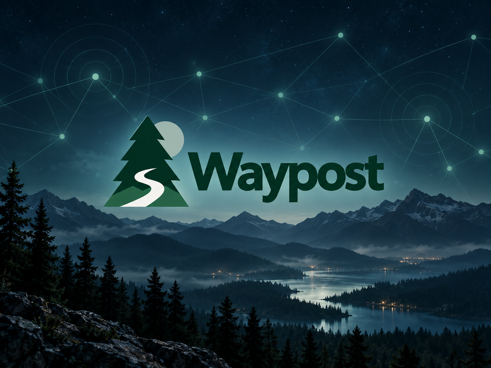
</p>

<h1 align="center">Waypost</h1>

<p align="center">
  <strong>Early alpha</strong> · an off-grid community network in the making<br/>
  Local Wi‑Fi for everyday use · long-range Waylink (LoRa) for what still needs to get through
</p>

---

**Waypost** aims to be a self-contained community network you can run without the Internet: a Raspberry Pi **Station**, local Wi‑Fi, LoRa mesh, handheld **Pockets**, and cheap **Outpost** nodes — with familiar apps like chat, mail, a wiki, files, and notices.

That is the goal. **It is not there yet.**

## Status

**Early alpha.** Useful for contributors exploring the design — not ready for a real community deployment.

**Honest snapshot:**

| Have today | Don’t have yet |
|------------|----------------|
| Laptop Station API + portal prototypes | Plug-and-play Pi Station / Waygate Wi‑Fi |
| Heltec Dispatch over air (M2c) + [radio-dev](docs/radio-dev.md); **M2e** encrypted Dispatch over LoRa (Reticulum on RNode-flashed Heltec V3) ✅ | Encrypted radio on the Pi Station by default |
| **N1** opportunistic queue + Signal/Today sync | Mesh peer path without Station (**M3** 🟡: peer↔peer + multi-hop courier + `MSG_SYNC` + Wi‑Fi↔LoRa failover in sim ✅; hardware pending) |
| **N2** username/password (portal + Pocket Wi‑Fi) ✅ | Stalwart/OIDC; TLS on camp Wi‑Fi (**M1b**) |

Expect breakage, missing pieces, and rapid change. Priorities: **[docs/priority-review.md](docs/priority-review.md)** · plan: **[docs/roadmap.md](docs/roadmap.md)**.

**Multi-agent handoff:** Cursor and Claude coordinate via **[AGENT_HANDOFF.md](AGENT_HANDOFF.md)** (read/update on every new direction). Claude also loads [CLAUDE.md](CLAUDE.md).

If you want a polished off-grid network today, this project is not that yet. If you want to help build one, welcome.

## Prototype UI (screenshots)

These are **early prototype** captures of the laptop Station portal — not a shipping product. Regenerated with Playwright: see [docs/screenshots/](docs/screenshots/).

<p align="center">
  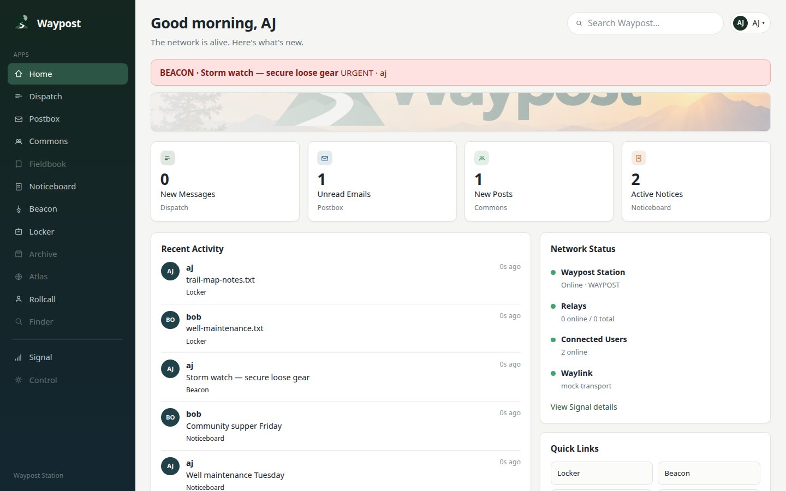
</p>

<details>
<summary>More prototype screens (Dispatch, Postbox, Commons, Noticeboard, Beacon, Locker, Rollcall, Signal)</summary>

| | |
|:---:|:---:|
| 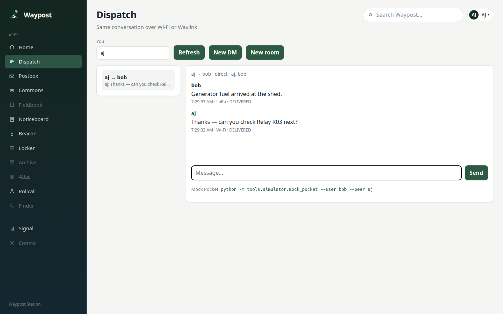 | 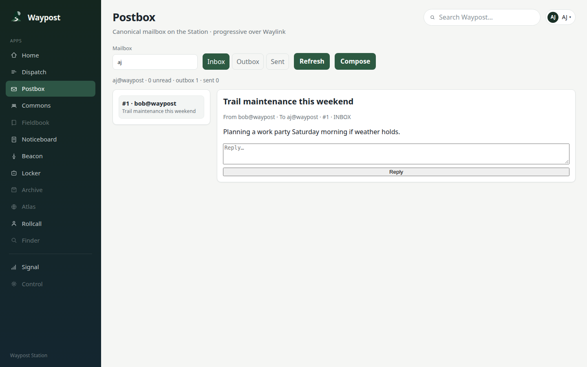 |
| 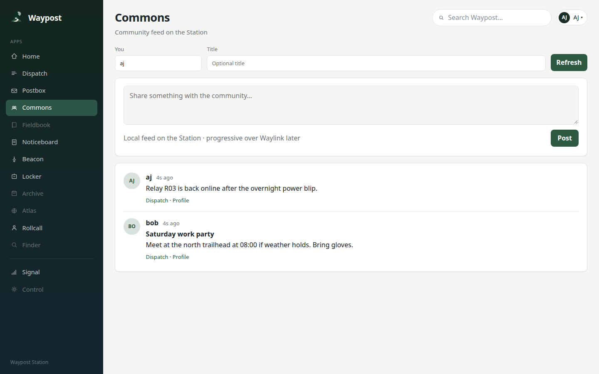 | 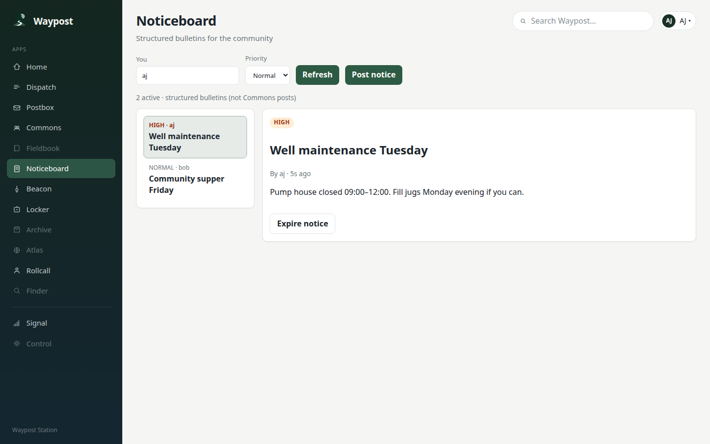 |
| 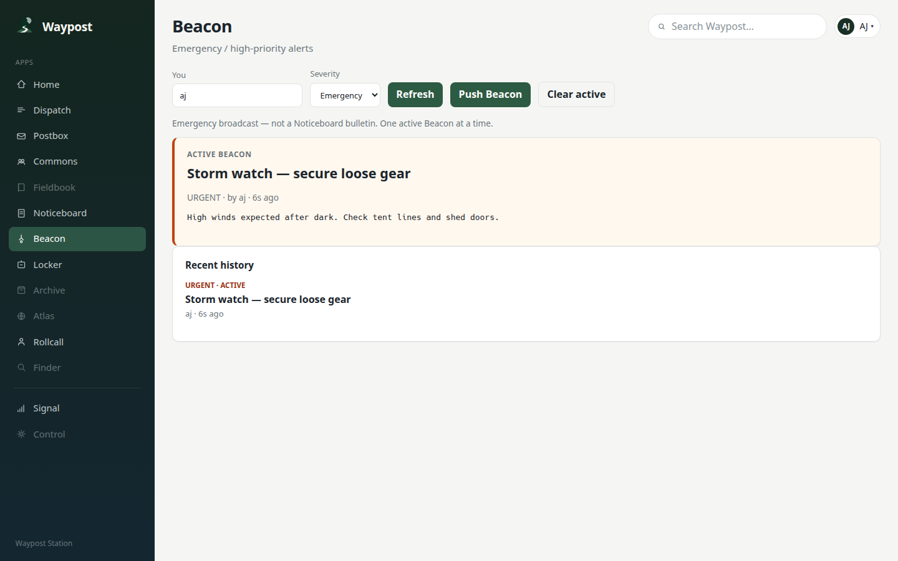 | 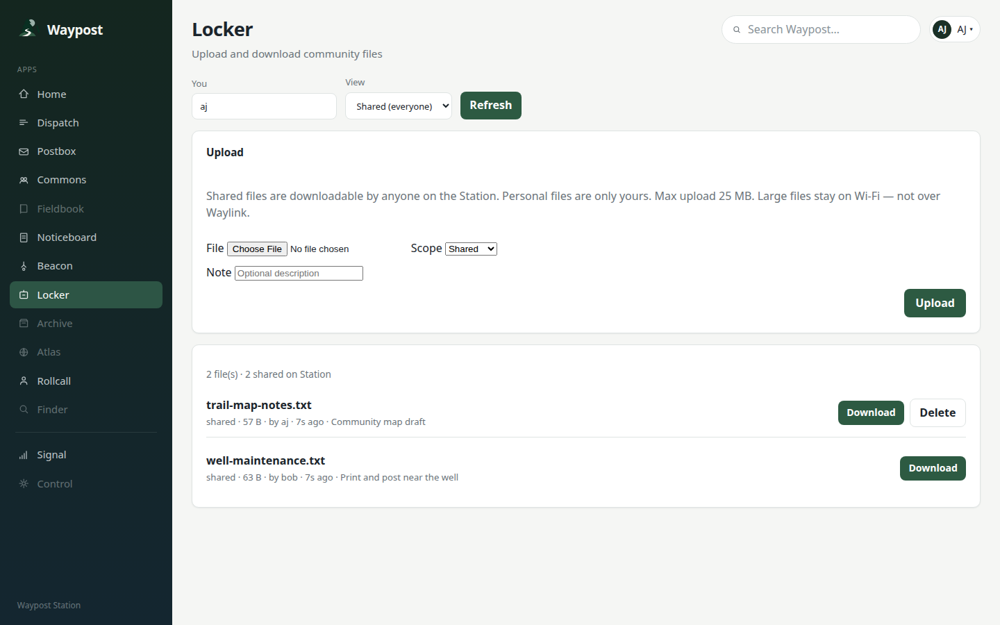 |
| 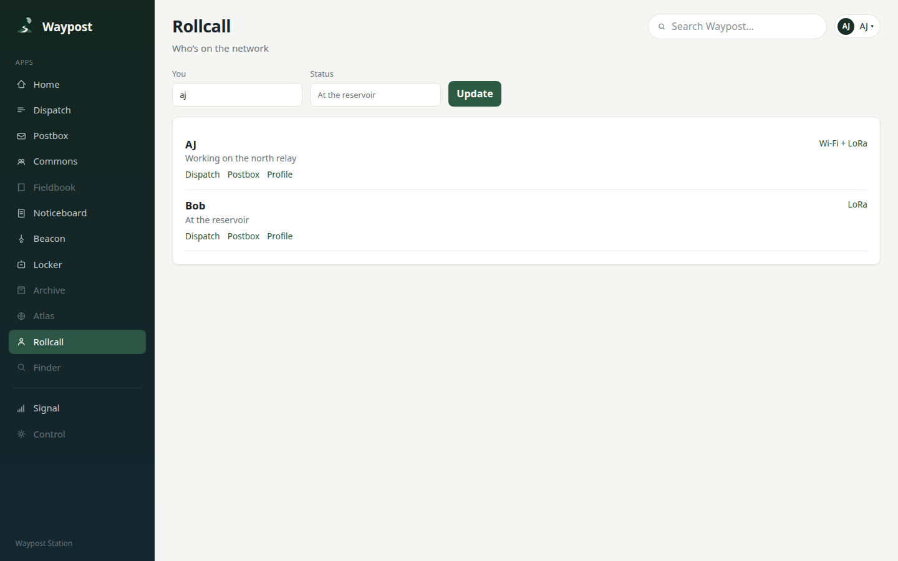 | 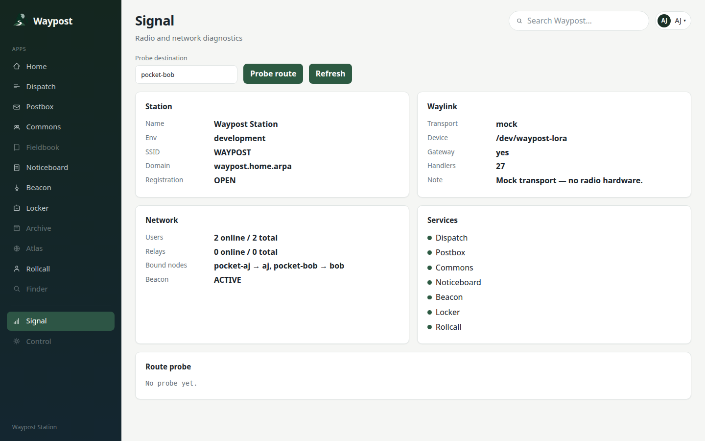 |
| 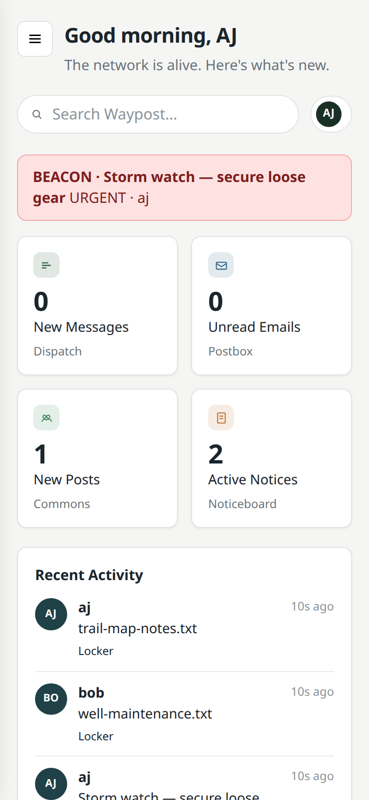 | |

</details>

## What we’re building toward

| Name | Role |
|------|------|
| **Waypost** | The overall platform / network |
| **Waypost Station** | Raspberry Pi community server |
| **Waypost Pocket** | LilyGO T-Deck handheld |
| **Waypost Outpost** | ESP32 LoRa hop / coverage node |
| **Waylink** | Radio / transport layer |
| **Waygate** | Captive portal when you join Wi‑Fi |

Planned apps include **Dispatch**, **Postbox**, **Rollcall**, **Commons**, **Fieldbook**, **Noticeboard**, **Beacon**, **Locker**, **Archive**, **Atlas**, **Finder**, and more. Names and intent are in [docs/naming.md](docs/naming.md); branding notes in [docs/brand.md](docs/brand.md).

Design idea in one line: full community computing over local Wi‑Fi, with the important stuff still reachable over slow LoRa — without pretending LoRa is the Internet.

## For developers (laptop only)

You can run the unfinished Station API and web shell locally:

```bash
uv venv .venv
source .venv/bin/activate
uv pip install -r server/requirements.txt
./tools/provisioning/bootstrap-dev.sh

uvicorn server.api.main:app --reload --host 0.0.0.0 --port 8000
```

Then open http://127.0.0.1:8000/ — expect prototype UI and incomplete features.

```bash
pytest server/tests -q
python -m tools.simulator.mock_pocket --user bob --peer aj   # mock handheld, not real hardware
```

Regenerate portal screenshots for the README / docs:

```bash
uv pip install -r server/requirements-dev.txt
playwright install chromium
python -m tools.screenshots.capture
pytest server/tests/test_screenshots.py -q
```

## Repository layout

```text
image/          Brand artwork
docs/           Architecture, protocol, **roadmap/milestones**, hardware notes
server/         Station API (early)
web/portal/     Web UI shell (early)
firmware/       Heltec bridge (dev); Pocket/Outpost still early
shared/         Shared protocol bits
deploy/         Pi install templates (unvalidated on hardware)
tools/          Simulators, radio helpers, screenshots
```

## Documentation

- [Architecture](docs/architecture.md)
- [Priority review](docs/priority-review.md)
- [Roadmap](docs/roadmap.md)
- [Naming](docs/naming.md)
- [Brand](docs/brand.md)
- [Protocol](docs/protocol.md)
- [Security](docs/security.md)
- [Deployment](docs/deployment.md)
- [Hardware](docs/hardware/)
- [Heltec USB LoRa (dev radios)](docs/hardware/heltec-wifi-lora-32.md)
- [Radio-dev runbook](docs/radio-dev.md)
- [ADRs](docs/adr/)
- [Portal screenshots](docs/screenshots/)

## License

MIT — see [LICENSE](LICENSE).
